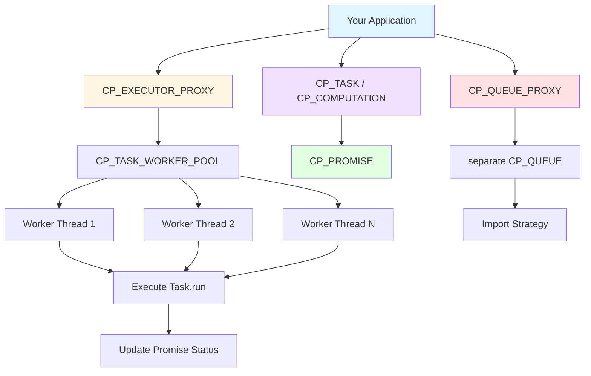
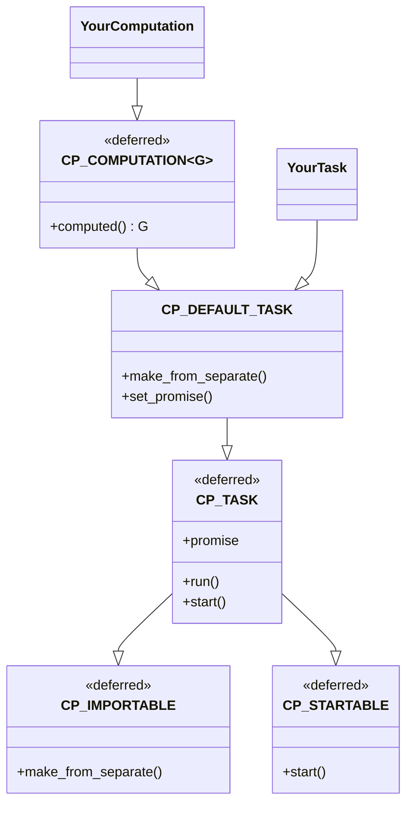
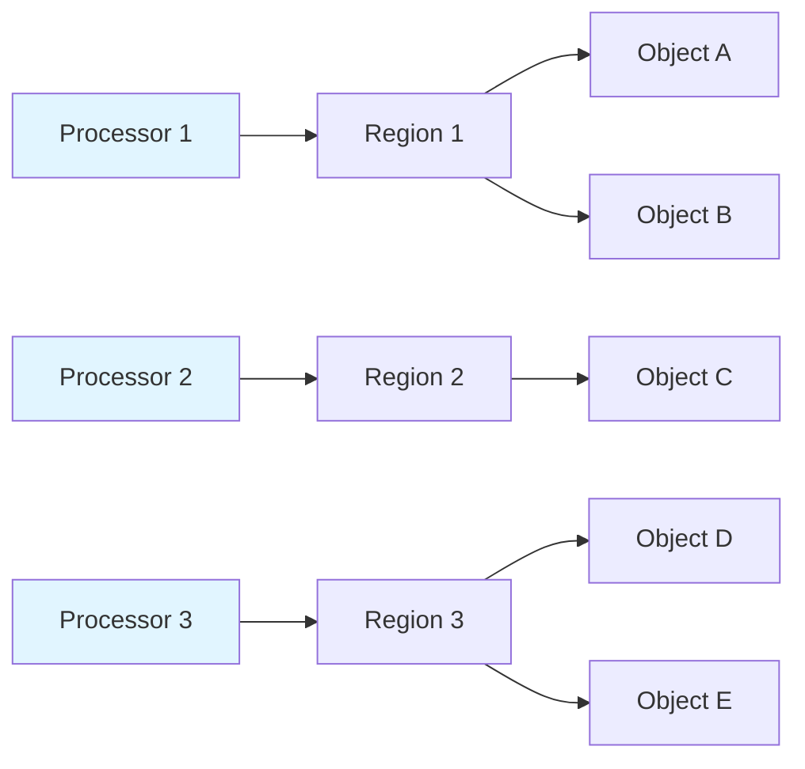
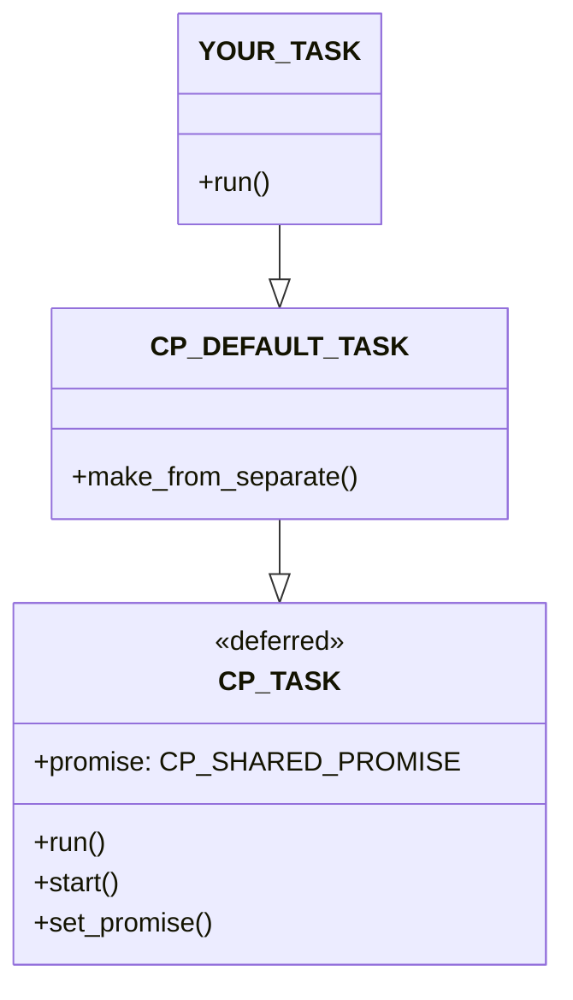
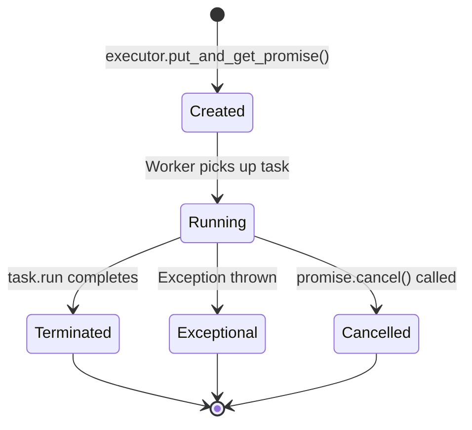

# SCOOP Patterns Usage Guide v2

> **Note**: This is version 2 of the SCOOP patterns documentation, significantly enhanced with architecture insights, troubleshooting guidance, performance optimization tips, and complete working examples from the library source code.

## What's New in v2

- **Architecture Overview**: Visual diagrams showing how patterns relate to each other
- **SCOOP Fundamentals**: Added comprehensive SCOOP tutorial content (regions, processors, wait-by-necessity, preconditions as wait conditions)
- **Expert Insights**: Critical warnings and best practices from Alexander Kogtenkov and Eric Bezault based on real-world experience
- **Core Concepts Enhanced**: Added `CP_IMPORTABLE`, `CP_PROXY`, and `CP_DEFAULT_TASK` explanations
- **Complete Working Examples**: Real examples from the library source code
- **Troubleshooting Section**: Common errors and solutions
- **Performance Guide**: Worker pool sizing, queue configuration, and optimization tips
- **Testing Guide**: How to test concurrent SCOOP code
- **Migration Guide**: Step-by-step approach to convert sequential to concurrent code
- **Quick Reference**: Cheat sheet for common operations

## Table of Contents

1. [Quick Start](#quick-start)
2. [When to Use SCOOP Patterns](#when-to-use-scoop-patterns)
3. [Architecture Overview](#architecture-overview)
4. [Core Concepts](#core-concepts)
5. [Pattern Reference](#pattern-reference)
   - [Task Pattern](#task-pattern)
   - [Computation Pattern (Futures)](#computation-pattern-futures)
   - [Promise Pattern](#promise-pattern)
   - [Queue Pattern](#queue-pattern)
   - [Executor Pattern](#executor-pattern)
   - [Worker Pool Pattern](#worker-pool-pattern)
   - [Process Patterns](#process-patterns)
   - [Agent Integration](#agent-integration)
5. [Import Strategies](#import-strategies)
6. [Complete Examples](#complete-examples)
7. [Troubleshooting](#troubleshooting)
8. [Performance Guide](#performance-guide)
9. [Testing SCOOP Code](#testing-scoop-code)
10. [Migration Guide](#migration-guide)
11. [Best Practices](#best-practices)
12. [Common Pitfalls and Expert Insights](#common-pitfalls-and-expert-insights)
13. [Quick Reference](#quick-reference-card)
14. [Glossary](#glossary)
15. [References](#references)

---

## Quick Start

### 5-Minute Introduction

SCOOP Patterns provides high-level abstractions for concurrent programming in Eiffel. Here's how to execute a simple asynchronous operation:

```eiffel
-- 1. Create a task
class MY_TASK
inherit
    CP_DEFAULT_TASK
feature
    run
        do
            -- Your work here
            print ("Task executed!%N")
        end
end

-- 2. Execute it
local
    worker_pool: separate CP_TASK_WORKER_POOL
    executor: CP_EXECUTOR_PROXY
    task: separate MY_TASK
do
    create worker_pool.make (10, 4)  -- Queue size: 10, Workers: 4
    create executor.make (worker_pool)
    create task
    executor.put (task)
    executor.stop
end
```

**Key Points**:
- Inherit from `CP_DEFAULT_TASK` for simple tasks
- Use `CP_EXECUTOR_PROXY` to submit tasks
- Always call `stop` on executor when done

---

## When to Use SCOOP Patterns

### The Decision: Patterns vs Raw SCOOP

**Critical Question**: Do you really need the SCOOP Patterns library, or is raw SCOOP simpler for your use case?

The SCOOP Patterns library adds abstraction layers (executors, worker pools, promises, queues) that are valuable for **complex concurrent applications** but can be overkill for simple scenarios.

### Use Raw SCOOP When:

#### 1. Simple Asynchronous Operations

**Scenario**: You just need one or two separate objects running independently.

```eiffel
-- Raw SCOOP is perfect here
class SIMPLE_DOWNLOAD
feature
    main
        local
            downloader: separate DOWNLOADER
        do
            create downloader.make ("https://example.com/file.zip")
            async_start (downloader)  -- Runs on separate processor
            
            -- Continue with other work
            process_local_data
        end
end

class DOWNLOADER
inherit
    CP_STARTABLE  -- Just need start, not full CP_TASK
feature
    make (url: STRING) do ... end
    start do download_file end
end
```

**Why raw SCOOP**: No need for executors, promises, or worker pools—just one separate object.

#### 2. Direct Producer-Consumer

**Scenario**: Single producer, single consumer with simple synchronization.

```eiffel
-- Raw SCOOP with preconditions
class SIMPLE_QUEUE_EXAMPLE
feature
    produce (queue: separate BOUNDED_QUEUE [INTEGER])
        require
            not_full: not queue.is_full
        do
            queue.put (next_item)
        end
    
    consume (queue: separate BOUNDED_QUEUE [INTEGER])
        require
            not_empty: not queue.is_empty
        do
            process (queue.item)
            queue.remove
        end
end
```

**Why raw SCOOP**: Built-in precondition-based synchronization is sufficient.

#### 3. Domain-Specific Synchronization

**Scenario**: Your synchronization logic is tightly coupled to business rules.

```eiffel
-- Custom synchronization for your specific domain
class BANK_ACCOUNT_TRANSFER
feature
    transfer (from: separate ACCOUNT; to: separate ACCOUNT; amount: REAL)
        require
            sufficient_funds: from.balance >= amount
            accounts_valid: not from.is_locked and not to.is_locked
        do
            -- Custom atomic transfer logic
            from.withdraw (amount)
            to.deposit (amount)
        end
end
```

**Why raw SCOOP**: The patterns library can't know your business logic; custom is clearer.

### Use SCOOP Patterns When:

#### 1. You Need a Worker Pool

**Scenario**: Many similar tasks that should execute concurrently with controlled parallelism.

```eiffel
-- SCOOP Patterns shines here
local
    worker_pool: separate CP_TASK_WORKER_POOL
    executor: CP_EXECUTOR_PROXY
    task: separate IMAGE_PROCESSING_TASK
do
    create worker_pool.make (100, 8)  -- Manage 8 concurrent workers
    create executor.make (worker_pool)
    
    -- Submit 1000 tasks, executed by 8 workers
    across image_files as file loop
        create task.make (file.item)
        executor.put (task)
    end
    
    executor.stop
end
```

**Why patterns**: Managing multiple workers, queuing, and load balancing manually is complex.

#### 2. You Need Result Collection (Futures)

**Scenario**: Multiple asynchronous operations that return results you need to collect.

```eiffel
-- SCOOP Patterns provides clean futures
local
    executor: CP_FUTURE_EXECUTOR_PROXY [RESULT, CP_STATIC_TYPE_IMPORTER [RESULT]]
    promises: ARRAYED_LIST [CP_RESULT_PROMISE_PROXY [RESULT, ...]]
    computation: separate MY_COMPUTATION
do
    -- Submit many computations
    across inputs as input loop
        create computation.make (input.item)
        promises.extend (executor.put_and_get_result_promise (computation))
    end
    
    -- Collect all results
    across promises as p loop
        results.extend (p.item.item)  -- Clean promise-based access
    end
end
```

**Why patterns**: Raw SCOOP has no built-in promise/future mechanism.

#### 3. You Need Exception Tracking

**Scenario**: Multiple tasks that may fail, and you need to know which ones failed.

```eiffel
-- SCOOP Patterns tracks exceptions per task
local
    promise: CP_PROMISE_PROXY
do
    promise := executor.put_and_get_promise (task)
    promise.await_termination
    
    if promise.is_exceptional then
        log_error ("Task failed: " + promise.last_exception_trace)
    else
        log_success ("Task completed")
    end
end
```

**Why patterns**: Raw SCOOP lacks structured exception tracking across processors.

#### 4. You Need Progress Monitoring

**Scenario**: Long-running tasks where you want to show progress to users.

```eiffel
-- SCOOP Patterns supports progress
local
    promise: CP_PROMISE_PROXY
do
    promise := executor.put_and_get_promise (long_task)
    
    from until promise.is_terminated loop
        update_progress_bar (promise.progress)  -- 0.0 to 1.0
        sleep_milliseconds (100)
    end
end
```

**Why patterns**: Progress tracking is built into the promise pattern.

#### 5. You Need Cancellation

**Scenario**: User should be able to cancel long-running operations.

```eiffel
-- SCOOP Patterns supports cancellation
if user_clicked_cancel then
    promise.cancel
end
```

**Why patterns**: Coordinated cancellation across tasks and workers is handled for you.

### Decision Matrix

| Your Needs | Recommendation |
|------------|----------------|
| 1-2 separate objects | **Raw SCOOP** |
| Simple producer-consumer | **Raw SCOOP** |
| Domain-specific synchronization | **Raw SCOOP** |
| Many concurrent tasks (>10) | **SCOOP Patterns** |
| Need to collect results from tasks | **SCOOP Patterns** |
| Need exception tracking | **SCOOP Patterns** |
| Need progress monitoring | **SCOOP Patterns** |
| Need cancellation | **SCOOP Patterns** |
| Worker pool management | **SCOOP Patterns** |
| Task queuing and scheduling | **SCOOP Patterns** |

### The Hybrid Approach

You can **mix both**:

```eiffel
-- Use raw SCOOP for simple parts
class APPLICATION
feature
    logger: separate LOGGER  -- Simple separate object
    
    process_files
        local
            executor: CP_EXECUTOR_PROXY  -- Patterns for heavy lifting
            task: separate FILE_TASK
        do
            create executor.make (worker_pool)
            
            across files as file loop
                create task.make (file.item)
                executor.put (task)
                
                -- Log using raw SCOOP
                log_async (logger, "Submitted: " + file.item)
            end
            
            executor.stop
        end
    
    log_async (l: separate LOGGER; msg: STRING)
        do
            l.log (msg)
        end
end
```

### Red Flags: You're Over-Engineering

If you find yourself doing any of these, you might be using patterns when raw SCOOP would be simpler:

1. **Creating executors for single tasks**: Just use `async_start` instead
2. **Creating worker pool with 1 worker**: Just use a separate object
3. **Creating promises you never check**: Don't need status tracking? Don't use promises
4. **Complex import strategies for basic types**: Just pass them directly
5. **Wrapping every separate call in a task**: Sometimes a direct call is clearer

### The Pragmatic Rule

> **Start with raw SCOOP. Add patterns when you feel the pain of:**
> - Managing multiple workers manually
> - Tracking task status across many operations
> - Collecting results from concurrent computations
> - Handling exceptions from asynchronous work

Don't add abstraction until you need it.

---

## Architecture Overview

### Library Structure

The SCOOP patterns library is organized into logical modules:

```
scoop_patterns/library/
├── cp_task.e                 -- Core task interface
├── cp_computation.e          -- Computation (future) interface  
├── cp_default_task.e         -- Default task implementation
├── executor/                 -- Executor implementations
├── promise/                  -- Promise implementations
├── queue/                    -- Queue implementations
├── import/                   -- Import strategy implementations
├── worker_pool/              -- Worker pool implementations
├── process/                  -- Process implementations
├── agent_integration/        -- Agent-based task wrappers
└── util/                     -- Utility classes (proxies, etc.)
```

### Pattern Relationships



### Core Abstractions Hierarchy



---

## Core Concepts

### What is SCOOP?

**SCOOP** (Simple Concurrent Object-Oriented Programming) is Eiffel's built-in concurrency model that provides a safe, type-driven approach to concurrent programming.

**Key Principles**:
- **Processor-based**: Each object lives on a processor (logical thread)
- **Separate types**: Keyword `separate` marks objects on different processors  
- **Automatic synchronization**: The type system handles locking
- **No explicit locks**: Developers work with types, not locks
- **Contract-based synchronization**: Preconditions serve as wait conditions

### SCOOP Fundamentals

#### Regions and Processors

In SCOOP, concurrency is organized around **regions** and **processors**:



**Region**: A collection of objects that belong together.

**Processor**: The execution thread for a region. Each processor executes operations **sequentially** within its region.

**Key Insight**: Concurrency in SCOOP comes from **multiple processors** executing independently, but **each processor is internally sequential**, eliminating race conditions within a region.

#### The `separate` Keyword and Object-Processor Relationship

When you declare an object:

```eiffel
obj: MY_CLASS              -- Lives in Current processor's region
sep_obj: separate MY_CLASS -- May live in a different region/processor
```

**Non-separate reference**: Object is guaranteed to be in the same region as the current processor.

**Separate reference**: Object **may** be in a different region with a different processor.

#### Exclusive Access and the `separate` Instruction

To call features on separate objects, you need **exclusive access** to their processors:

```eiffel
feature
    process_data (downloader: separate DOWNLOADER)
        do
            separate downloader as d do
                -- Inside this block, we have exclusive access to downloader's processor
                d.start_download
                d.set_url ("http://example.com")
            end
            -- Lock released after block
        end
end
```

**How it works**:
1. The `separate` instruction **requests exclusive access** to the processor
2. Current processor **waits** until it can lock the separate processor(s)
3. Inside the block, operations execute with **guaranteed exclusive access**
4. Upon exiting, locks are **automatically released**

#### Asynchronous Call Semantics

Calls to separate objects have special semantics:

```eiffel
feature
    launch_download (downloader: separate DOWNLOADER)
        do
            downloader.start  -- Asynchronous: logged and executed later
            io.put_string ("Download started%N")  -- Runs immediately!
        end
        
    get_status (downloader: separate DOWNLOADER): BOOLEAN
        do
            Result := downloader.is_complete  -- Synchronous: waits for result
        end
end
```

**Commands** (procedures): Asynchronous, non-blocking
- Call is logged and returns immediately
- Actual execution happens later on the separate processor

**Queries** (functions): Synchronous, blocking (wait-by-necessity)
- Caller waits until the query executes and returns a result
- Automatic resynchronization

#### Wait-by-Necessity

When you query a separate object for a value, SCOOP automatically synchronizes:

```eiffel
feature
    example (compute: separate COMPUTATION)
        local
            result: INTEGER
        do
            compute.start_calculation  -- Asynchronous, returns immediately
            
            -- Do other work...
            perform_local_work
            
            result := compute.get_result  -- BLOCKS here until result is ready
            io.put_integer (result)  -- Now we have the result
        end
end
```

**Benefit**: You don't manually wait or poll—SCOOP handles synchronization automatically when you need results.

#### Preconditions as Wait Conditions

In SCOOP, **preconditions on separate arguments become synchronization guards**:

```eiffel
feature
    consume_item (queue: separate QUEUE [STRING])
        require
            not_empty: not queue.is_empty  -- WAIT until this is true!
        local
            item: STRING
        do
            item := queue.item
            queue.remove
            process (item)
        end
end
```

**Standard Eiffel**: Precondition violation → Exception

**SCOOP**: Precondition on separate argument → **Wait until condition is true**

**How it works**:
1. Caller attempts to call `consume_item`
2. If `queue.is_empty = True`, caller **waits**
3. When another processor makes the queue non-empty
4. The waiting processor can proceed with the call

**Example: Producer-Consumer Synchronization**:

```eiffel
class CONSUMER
feature
    consume (queue: separate CP_QUEUE [STRING, CP_STRING_IMPORTER])
        require
            has_data: not queue.is_empty  -- Wait for data
        do
            process_item (queue.item)
            queue.remove
        end
end

class PRODUCER
feature
    produce (queue: separate CP_QUEUE [STRING, CP_STRING_IMPORTER]; item: STRING)
        require
            has_space: not queue.is_full  -- Wait for  space
        do
            queue.put (item)
        end
end
```

No manual locks, no condition variables—just contracts!

#### Type Safety: Preventing "Traitors"

SCOOP's type system prevents dangerous situations:

```eiffel
feature
    -- ILLEGAL: Would create "traitor"
    bad_example (sep_obj: separate MY_CLASS)
        local
            my_ref: MY_CLASS  -- Non-separate!
        do
            my_ref := sep_obj  -- COMPILE ERROR!
            -- Would allow unsynchronized access to separate object
        end
        
    -- CORRECT: Keep it separate
    good_example (sep_obj: separate MY_CLASS)
        local
            my_ref: separate MY_CLASS
        do
            my_ref := sep_obj  -- OK, both separate
        end
end
```

**Traitor**: A non-separate reference pointing to an object in another region—would bypass SCOOP's safety guarantees. The compiler **prevents** this.

### The SCOOP Patterns Layer

The SCOOP Patterns library provides **higher-level abstractions** over raw SCOOP:

| Raw SCOOP | SCOOP Patterns |
|-----------|----------------|
| Manual separate declarations | Tasks and Computations |
| `separate` instructions for synchronization | Executors and Worker Pools |
| Manual precondition wait conditions | Import Strategies and Queues |
| Manual processor management | Automatic processor allocation |
| Complex data passing logic | Promise pattern for results |

### Understanding `separate`

Objects marked `separate` **may** live on a different processor:

```eiffel
my_object: MY_CLASS              -- On current processor
sep_object: separate MY_CLASS    -- On a separate processor
```

**Key Rules**:
1. Calls to separate objects require **wait conditions** (preconditions)
2. Calls to separate objects may **block** until conditions are met
3. Data passed to/from separate objects is **copied** (unless explicitly separate)

### The `CP_IMPORTABLE` Interface

To cross processor boundaries, objects must be **importable** (copyable):

```eiffel
deferred class CP_IMPORTABLE
feature
    make_from_separate (other: separate like Current)
        -- Initialize Current from separate other
    deferred
    end
end
```

**Why Important**:
- Tasks are copied when submitted to executors
- Each worker thread gets its own copy
- Task state must be serializable

**Example**:
```eiffel
class FILE_READER_TASK
inherit
    CP_DEFAULT_TASK
    
create
    make

feature {NONE} -- Initialization
    
    make (a_path: READABLE_STRING_8)
        do
            path := a_path.twin  -- Copy the string
        end
    
    make_from_separate (other: separate like Current)
        do
            create path.make_from_separate (other.path)
            -- Copy all attributes from other
        ensure then
            same_promise: promise = other.promise
        end
    
feature {NONE} -- Implementation
    
    path: STRING_8
    
feature -- Execution
    
    run
        local
            file: PLAIN_TEXT_FILE
        do
            create file.make_open_read (path)
            -- Read file...
            file.close
        end
end
```

### The Proxy Pattern (`CP_PROXY`)

**Problem**: Holding a reference to a separate object **keeps the processor locked**.

**Solution**: Use proxy wrappers that acquire and release locks quickly.

```eiffel
-- BAD: Holds lock on queue
queue: separate CP_QUEUE [STRING, CP_STRING_IMPORTER]
-- Every access to queue holds the lock

-- GOOD: Uses proxy
queue_proxy: CP_QUEUE_PROXY [STRING, CP_STRING_IMPORTER]
-- Proxy acquires lock only during operations
```

**How Proxies Work**:
```eiffel
class CP_QUEUE_PROXY [G, IMPORTER -> CP_IMPORT_STRATEGY [G]]
    
feature
    put (item: G)
        do
            put_impl (queue, item)  -- Acquires lock, puts, releases immediately
        end
        
feature {NONE}
    queue: separate CP_QUEUE [G, IMPORTER]
    
    put_impl (q: separate CP_QUEUE [G, IMPORTER]; item: G)
        do
            q.put (item)  -- Lock held only during this call
        end
end
```

### `CP_STARTABLE` vs `CP_TASK`

Two ways to execute concurrent operations:

| `CP_STARTABLE` | `CP_TASK` |
|----------------|-----------|
| Just defines `start` | Defines `start` and `run` |
| No promise support | Integrated with promises |
| Not importable by default | Implements `CP_IMPORTABLE` |
| For simple concurrent objects | For executor-based execution |

**When to Use Each**:
- **`CP_STARTABLE`**: Simple concurrent objects you start manually
- **`CP_TASK`**: Operations submitted to executors for managed execution

### Copy Semantics Across Processors

When data crosses processor boundaries, it's **copied** (unless marked separate):

```eiffel
feature
    send_to_task (a_task: separate MY_TASK; a_value: INTEGER)
        do
            a_task.set_value (a_value)  -- INTEGER is copied
        end
    
    send_object (a_task: separate MY_TASK; obj: MY_OBJECT)
        do
            a_task.set_object (obj)  
            -- MY_OBJECT is COPIED (deep copy if reference type)
            -- Import strategy determines how
        end
    
    send_separate (a_task: separate MY_TASK; obj: separate MY_OBJECT)
        do
            a_task.set_separate_object (obj)
            -- Reference passed, object stays on its processor
        end
```

---

## Pattern Reference

### Task Pattern

#### Overview

`CP_TASK` represents **asynchronous operations** that don't return values. Use for:
- Fire-and-forget operations
- Side-effect operations (I/O, database updates, logging)
- Operations that may throw exceptions

#### Class Hierarchy



#### Implementation Guide

**Use `CP_DEFAULT_TASK` as your base class** (not the deferred `CP_TASK`):

```eiffel
class FILE_WRITER_TASK
inherit
    CP_DEFAULT_TASK
    
create
    make

feature {NONE} -- Initialization
    
    make (a_path: READABLE_STRING_8; a_content: READABLE_STRING_8)
        do
            path := a_path.twin
            content := a_content.twin
        end
    
    make_from_separate (other: separate like Current)
        do
            create path.make_from_separate (other.path)
            create content.make_from_separate (other.content)
        ensure then
            same_promise: promise = other.promise
        end

feature {NONE} -- Implementation
    
    path: STRING_8
    content: STRING_8

feature -- Execution
    
    run
            -- Write content to file
        local
            file: PLAIN_TEXT_FILE
        do
            create file.make_create_read_write (path)
            file.put_string (content)
            file.flush
            file.close
        end
end
```

#### Usage with Executors

```eiffel
local
    worker_pool: separate CP_TASK_WORKER_POOL
    executor: CP_EXECUTOR_PROXY
    task: separate FILE_WRITER_TASK
    promise: CP_PROMISE_PROXY
do
    -- Create infrastructure
    create worker_pool.make (100, 4)
    create executor.make (worker_pool)
    
    -- Create and submit task
    create task.make ("/tmp/output.txt", "Hello, SCOOP!")
    promise := executor.put_and_get_promise (task)
    
    -- Do other work...
    
    -- Wait for completion
    promise.await_termination
    
    -- Check for errors
    if promise.is_exceptional then
        io.put_string ("Error: " + promise.last_exception_trace + "%N")
    end
    
    -- Cleanup
    executor.stop
end
```

#### Exception Handling

`CP_DEFAULT_TASK.start` automatically catches exceptions:

```eiffel
frozen start
        -- Start the current task
    local
        l_retried: BOOLEAN
        l_exception_manager: EXCEPTION_MANAGER
    do
        if not l_retried then
            run
            if attached promise as l_promise then
                promise_terminate (l_promise)  -- Mark successful
            end
        end
    rescue
        l_retried := True
        create l_exception_manager
        if attached l_exception_manager.last_exception as l_exception
            and attached promise as l_promise
        then
            promise_set_exception_and_terminate (l_promise, l_exception)
        end
        retry
    end
```

**Benefits**:
- Exceptions don't crash worker threads
- Exception trace captured in promise
- Client can check `promise.is_exceptional`

---

### Computation Pattern (Futures)

#### Overview

`CP_COMPUTATION` represents **asynchronous operations that return results**. This is the **Future pattern**.

Use for:
- Parallel calculations
- Asynchronous data retrieval
- Operations where you need the result later

#### Class Hierarchy

```eiffel
class CP_COMPUTATION [RESULT_TYPE]
inherit
    CP_DEFAULT_TASK
        redefine promise end

feature
    promise: detachable separate CP_SHARED_RESULT_PROMISE [RESULT_TYPE, CP_IMPORT_STRATEGY [RESULT_TYPE]]
    
    computed: RESULT_TYPE
        deferred
        end
end
```

#### Implementation Example

```eiffel
class FIBONACCI_COMPUTATION
inherit
    CP_COMPUTATION [INTEGER_64]
    
create
    make

feature {NONE} -- Initialization
    
    make (a_n: INTEGER)
        do
            n := a_n
        end
    
    make_from_separate (other: separate like Current)
        do
            n := other.n
        ensure then
            same_promise: promise = other.promise
        end

feature {NONE}
    
    n: INTEGER

feature -- Computation
    
    computed: INTEGER_64
            -- Calculate Fibonacci number
        local
            a, b, temp: INTEGER_64
            i: INTEGER
        do
            if n <= 1 then
                Result := n.to_integer_64
            else
                from
                    a := 0; b := 1; i := 2
                until
                    i > n
                loop
                    temp := a + b
                    a := b
                    b := temp
                    i := i + 1
                end
                Result := b
            end
        end
end
```

#### Usage with Future Executor

```eiffel
local
    worker_pool: separate CP_TASK_WORKER_POOL
    executor: CP_FUTURE_EXECUTOR_PROXY [INTEGER_64, CP_STATIC_TYPE_IMPORTER [INTEGER_64]]
    computation: separate FIBONACCI_COMPUTATION
    promise: CP_RESULT_PROMISE_PROXY [INTEGER_64, CP_STATIC_TYPE_IMPORTER [INTEGER_64]]
    result: INTEGER_64
do
    create worker_pool.make (100, 4)
    create executor.make (worker_pool)
    
    -- Submit computation
    create computation.make (40)
    promise := executor.put_and_get_result_promise (computation)
    
    -- Do other work while computing...
    
    -- Get result (blocks until ready)
    result := promise.item
    io.put_string ("Fibonacci(40) = " + result.out + "%N")
    
    executor.stop
end
```

#### Parallel Computation Example

Submit multiple computations in parallel:

```eiffel
local
    executor: CP_FUTURE_EXECUTOR_PROXY [INTEGER_64, CP_STATIC_TYPE_IMPORTER [INTEGER_64]]
    promises: ARRAYED_LIST [CP_RESULT_PROMISE_PROXY [INTEGER_64, CP_STATIC_TYPE_IMPORTER [INTEGER_64]]]
    computation: separate FIBONACCI_COMPUTATION
    i: INTEGER
do
    create executor.make (worker_pool)
    create promises.make (10)
    
    -- Submit 10 computations in parallel
    from i := 1 until i > 10 loop
        create computation.make (30 + i)
        promises.extend (executor.put_and_get_result_promise (computation))
        i := i + 1
    end
    
    -- Collect results
    across promises as p loop
        io.put_string ("Result: " + p.item.item.out + "%N")
    end
    
    executor.stop
end
```

---

### Promise Pattern

#### Overview

Promises track the **status and result** of asynchronous operations.

**Promise Types**:
1. `CP_PROMISE`: For tasks (no result)
2. `CP_RESULT_PROMISE [G]`: For computations (with result)

**Promise Variants**:
- `CP_SHARED_PROMISE`: The actual promise object on task's processor
- `CP_PROMISE_PROXY`: Non-locking wrapper for clients

#### Promise Lifecycle



#### Promise API

```eiffel
class CP_PROMISE
feature -- Status
    is_terminated: BOOLEAN
    is_successfully_terminated: BOOLEAN
    is_exceptional: BOOLEAN
    is_cancelled: BOOLEAN
    
feature -- Access
    last_exception_trace: detachable READABLE_STRING_32
    progress: DOUBLE  -- 0.0 to 1.0
    
feature -- Operations
    cancel
    await_termination
end
```

#### Usage Example

```eiffel
local
    promise: CP_PROMISE_PROXY
    task: separate LONG_RUNNING_TASK
do
    promise := executor.put_and_get_promise (task)
    
    -- Poll for completion
    from
    until
        promise.is_terminated
    loop
        io.put_string ("Progress: " + (promise.progress * 100).out + "%%%N")
        sleep_milliseconds (1000)
    end
    
    -- Check outcome
    if promise.is_exceptional then
        io.put_string ("Task failed with: " + promise.last_exception_trace + "%N")
    elseif promise.is_cancelled then
        io.put_string ("Task was cancelled%N")
    else
        io.put_string ("Task completed successfully%N")
    end
end
```

#### Cancellation Support

Tasks must check `promise.is_cancelled` to support cancellation:

```eiffel
class CANCELLABLE_TASK
inherit
    CP_DEFAULT_TASK

feature
    run
        local
            i: INTEGER
        do
            from i := 1 until i > 1000 loop
                -- Check for cancellation
                if attached promise as p and then is_promise_cancelled (p) then
                    io.put_string ("Task cancelled%N")
                    -- Cleanup and exit
                else
                    -- Do work
                    perform_work_item (i)
                    i := i + 1
                end
            end
        end
        
feature {NONE}
    
    is_promise_cancelled (p: separate CP_SHARED_PROMISE): BOOLEAN
        do
            Result := p.is_cancelled
        end
end
```

---

### Queue Pattern

#### Overview

`CP_QUEUE` enables **thread-safe data exchange** between processors.

Use for:
- Producer-consumer patterns
- Pipeline architectures
- Buffering between processing stages

#### Queue Types

| Type | Behavior | Use Case |
|------|----------|----------|
| Bounded | Fixed capacity, `put` blocks when full | Preventing memory overflow |
| Unbounded | Unlimited capacity | When memory isn't a concern |

#### Implementation

```eiffel
class CP_QUEUE [G, IMPORTER -> CP_IMPORT_STRATEGY [G]]

create
    make_bounded, make_unbounded

feature
    put (item: separate G)
        require
            not_full: not is_full
        do
            store.put (importer.import (item))
        end
    
    item: like importer.import
        require
            not_empty: not is_empty
        do
            Result := store.item
        end
    
    remove
        require
            not_empty: not is_empty
        do
            store.remove
        end
end
```

#### Queue Proxy Pattern

**Always use `CP_QUEUE_PROXY`** to avoid holding locks:

```eiffel
class CP_QUEUE_PROXY [G, IMPORTER -> CP_IMPORT_STRATEGY [G]]

feature
    put (item: G)
        do
            put_impl (queue, item)  -- Acquires lock only briefly
        end
    
    consume
            -- Remove item and store it
        do
            consume_impl (queue)
        end
    
    last_consumed_item: detachable G
        -- Item from last consume call
        
feature {NONE}
    queue: separate CP_QUEUE [G, IMPORTER]
    
    put_impl (q: separate CP_QUEUE [G, IMPORTER]; item: G)
        do
            q.put (item)
        end
    
    consume_impl (q: separate CP_QUEUE [G, IMPORTER])
        require
            q.is_empty = False
        do
            last_consumed_item := q.item
            q.remove
        end
end
```

#### Complete Producer-Consumer Example

From library source code:

**Producer**:
```eiffel
class PRODUCER
inherit
    CP_STARTABLE

create
    make

feature {NONE}
    make (a_queue: separate CP_QUEUE [STRING, CP_STRING_IMPORTER]; 
          a_id: INTEGER; a_count: INTEGER)
        do
            identifier := a_id
            item_count := a_count
            create queue_wrapper.make (a_queue)
        end
    
    queue_wrapper: CP_QUEUE_PROXY [STRING, CP_STRING_IMPORTER]
    identifier: INTEGER
    item_count: INTEGER

feature
    start
        local
            i: INTEGER
        do
            from i := 1 until i > item_count loop
                queue_wrapper.put ("Producer " + identifier.out + ": item " + i.out)
                i := i + 1
            end
        end
end
```

**Consumer**:
```eiffel
class CONSUMER
inherit
    CP_STARTABLE

create
    make

feature {NONE}
    make (a_queue: separate CP_QUEUE [STRING, CP_STRING_IMPORTER];
          a_id: INTEGER; a_count: INTEGER)
        do
            identifier := a_id
            item_count := a_count
            create queue_wrapper.make (a_queue)
            -- NOTE: Cannot put main loop here!
            -- Would hold lock on a_queue during entire lifecycle
        end
    
    queue_wrapper: CP_QUEUE_PROXY [STRING, CP_STRING_IMPORTER]
    identifier: INTEGER
    item_count: INTEGER

feature
    start
        local
            i: INTEGER
        do
            from i := 1 until i > item_count loop
                queue_wrapper.consume
                
                check attached queue_wrapper.last_consumed_item as item then
                    print (item + " // Consumer " + identifier.out + ": item " + i.out + "%N")
                end
                
                i := i + 1
            end
        end
end
```

**Application**:
```eiffel
class PRODUCER_CONSUMER
inherit
    CP_STARTABLE_UTILS  -- Provides async_start

create
    make

feature
    make
        local
            l_queue: separate CP_QUEUE [STRING, CP_STRING_IMPORTER]
            l_producer: separate PRODUCER
            l_consumer: separate CONSUMER
        do
            create l_queue.make_bounded (5)
            
            -- Start consumers
            across 1 |..| 10 as i loop
                create l_consumer.make (l_queue, i.item, 20)
                async_start (l_consumer)
            end
            
            -- Start producers
            across 1 |..| 10 as i loop
                create l_producer.make (l_queue, i.item, 20)
                async_start (l_producer)
            end
        end
end
```

---

### Executor Pattern

#### Overview

Executors manage **task submission and execution** using worker pools.

**Executor Types**:
1. `CP_EXECUTOR`: For tasks (no results)
2. `CP_FUTURE_EXECUTOR [G, ...]`: For computations (with results)

#### Executor API

```eiffel
class CP_EXECUTOR
feature
    put (task: separate CP_TASK)
        require
            not_full: not is_full
        deferred
        end
    
    stop
        deferred
        end
end
```

#### Executor Proxy Usage

```eiffel
local
    worker_pool: separate CP_TASK_WORKER_POOL
    executor: CP_EXECUTOR_PROXY
    task: separate MY_TASK
    promise: CP_PROMISE_PROXY
do
    -- Create worker pool
    create worker_pool.make (100, 4)  -- queue_capacity: 100, workers: 4
    
    -- Create executor proxy
    create executor.make (worker_pool)
    
    -- Submit tasks
    create task.make
    executor.put (task)
    
    -- Or get promise
    promise := executor.put_and_get_promise (task)
    promise.await_termination
    
    -- Always stop!
    executor.stop
end
```

#### Future Executor Usage

```eiffel
local
    worker_pool: separate CP_TASK_WORKER_POOL
    executor: CP_FUTURE_EXECUTOR_PROXY [STRING, CP_STRING_IMPORTER]
    computation: separate STRING_COMPUTATION
    promise: CP_RESULT_PROMISE_PROXY [STRING, CP_STRING_IMPORTER]
do
    create worker_pool.make (100, 4)
    create executor.make (worker_pool)
    
    create computation.make (...)
    promise := executor.put_and_get_result_promise (computation)
    
    -- Get result
    result := promise.item  -- Blocks until ready
    
    executor.stop
end
```

---

### Worker Pool Pattern

#### Overview

`CP_TASK_WORKER_POOL` manages a **pool of worker threads** that execute tasks.

**Configuration**:
- **Queue capacity**: Maximum number of pending tasks
- **Worker count**: Number of concurrent threads

#### Creation

```eiffel
create worker_pool.make (queue_capacity, worker_count)
    -- queue_capacity: Buffer size for pending tasks
    -- worker_count: Number of concurrent worker threads
```

#### Sizing Guidelines

| Workload Type | Worker Count | Queue Capacity |
|---------------|--------------|----------------|
| CPU-bound | ≈ CPU cores | Small (10-50) |
| I/O-bound | 2-4× CPU cores | Medium (50-200) |
| Mixed | 1.5× CPU cores | Medium (50-100) |

**Example**:
```eiffel
-- For 8-core machine with I/O-heavy tasks
create worker_pool.make (100, 16)
```

---

### Process Patterns

#### Overview

Process patterns for **periodic or continuous execution**.

**Process Types**:
1. `CP_PERIODIC_PROCESS`: Runs at fixed intervals
2. `CP_CONTINUOUS_PROCESS`: Runs continuously
3. `CP_INTERMITTENT_PROCESS`: Runs with breaks

#### Periodic Process Example

```eiffel
class HEARTBEAT_PROCESS
inherit
    CP_PERIODIC_PROCESS

create
    make

feature
    run
        do
            io.put_string ("[Heartbeat] " + timestamp + "%N")
        end
    
feature {NONE}
    timestamp: STRING
        do
            create Result.make_from_string (...)
        end
end

-- Usage
local
    heartbeat: separate HEARTBEAT_PROCESS
do
    -- Run every 5 seconds (nanoseconds)
    create heartbeat.make (5_000_000_000)
    async_start (heartbeat)
    
    -- Stop later
    heartbeat.stop
end
```

---

### Agent Integration

#### Overview

Execute Eiffel agents asynchronously using `CP_AGENT_TASK`.

#### Restrictions

Agents must satisfy:
1. All closed arguments must be truly separate or basic/expanded types
2. Target must be open
3. No leftovers from previous calls (`operands` must be Void)
4. Target type must not declare attributes
5. No open arguments except the target

#### Usage

```eiffel
local
    agent_task: separate CP_AGENT_TASK
    my_agent: PROCEDURE [MY_CLASS, INTEGER]
    obj: separate MY_CLASS
do
    create obj
    my_agent := agent {MY_CLASS}.do_work (?)
    
    -- Use make_safe to validate restrictions
    create agent_task.make_safe (my_agent, [42])
    
    executor.put (agent_task)
end
```

---

## Import Strategies

### Overview

Import strategies control **how data is copied** between processors.

### How Import Strategies Work

When data crosses processor boundaries:

```eiffel
feature
    send_data (queue: separate CP_QUEUE [STRING, CP_STRING_IMPORTER]; data: STRING)
        do
            queue.put (data)
            -- CP_STRING_IMPORTER creates a copy of data
            -- Copy is placed on queue's processor
        end
```

The import strategy's `import` feature is called:

```eiffel
class CP_STRING_IMPORTER
inherit
    CP_IMPORT_STRATEGY [STRING]

feature
    import (s: separate STRING): STRING
        do
            create Result.make_from_separate (s)  -- Deep copy
        end
end
```

### Available Strategies

#### 1. `CP_STRING_IMPORTER`

For strings; creates deep copy.

```eiffel
queue: separate CP_QUEUE [STRING, CP_STRING_IMPORTER]
```

#### 2. `CP_STATIC_TYPE_IMPORTER [G]`

For any type that supports `make_from_separate`.

```eiffel
queue: separate CP_QUEUE [MY_DATA, CP_STATIC_TYPE_IMPORTER [MY_DATA]]
```

**Requirements**: `MY_DATA` must have:
```eiffel
class MY_DATA
create
    make_from_separate

feature
    make_from_separate (other: separate like Current)
        do
            -- Copy all attributes
        end
end
```

#### 3. `CP_DYNAMIC_TYPE_IMPORTER [G]`

For runtime type determination; uses deep clone.

```eiffel
importer: CP_DYNAMIC_TYPE_IMPORTER [ANY]
```

#### 4. `CP_NO_IMPORTER`

No copy; object stays on separate processor.

```eiffel
queue: separate CP_QUEUE [separate MY_OBJECT, CP_NO_IMPORTER]
```

**Warning**: Now passing separate references; more complex synchronization.

#### 5. `CP_TUPLE_IMPORTER`

For tuples.

```eiffel
importer: CP_TUPLE_IMPORTER
```

### Choosing an Import Strategy

```mermaid
graph TD
    Start{What type?} --> String[String]
    Start --> Basic[Basic/Expanded]
    Start --> Reference[Reference Type]
    
    String --> UseString[CP_STRING_IMPORTER]
    Basic --> UseStatic[CP_STATIC_TYPE_IMPORTER]
    
    Reference --> {Has make_from_separate?}
    Reference --> Yes[Yes]
    Reference --> No[No]
    
    Yes --> UseStatic2[CP_STATIC_TYPE_IMPORTER]
    No --> Large{Large object?}
    
    Large --> YesLarge[Yes, expensive to copy]
    Large --> NoLarge[No, small]
    
    YesLarge --> UseNoImport[CP_NO_IMPORTER<br/>Keep on separate processor]
    NoLarge --> UseDynamic[CP_DYNAMIC_TYPE_IMPORTER<br/>or implement make_from_separate]
```

---

## Complete Examples

### Example 1: Parallel File Processing

```eiffel
class FILE_READER
inherit
    CP_COMPUTATION [STRING]

create
    make

feature {NONE}
    make (a_path: STRING)
        do
            path := a_path.twin
        end
    
    make_from_separate (other: separate like Current)
        do
            create path.make_from_separate (other.path)
        ensure then
            same_promise: promise = other.promise
        end
    
    path: STRING

feature
    computed: STRING
        local
            file: PLAIN_TEXT_FILE
        do
            create file.make_open_read (path)
            file.read_stream (file.count)
            Result := file.last_string.twin
            file.close
        end
end

-- Main application
class APPLICATION
create
    make

feature
    make
        local
            worker_pool: separate CP_TASK_WORKER_POOL
            executor: CP_FUTURE_EXECUTOR_PROXY [STRING, CP_STRING_IMPORTER]
            file_paths: ARRAY [STRING]
            computation: separate FILE_READER
            promises: ARRAYED_LIST [CP_RESULT_PROMISE_PROXY [STRING, CP_STRING_IMPORTER]]
            content: STRING
        do
            file_paths := <<"file1.txt", "file2.txt", "file3.txt", "file4.txt">>
            
            create worker_pool.make (100, 4)
            create executor.make (worker_pool)
            create promises.make (file_paths.count)
            
            -- Submit all reads in parallel
            across file_paths as path loop
                create computation.make (path.item)
                promises.extend (executor.put_and_get_result_promise (computation))
            end
            
            -- Collect results
            across promises as p loop
                content := p.item.item
                io.put_string ("Read " + content.count.out + " bytes%N")
            end
            
            executor.stop
        end
end
```

### Example 2: Pipeline Architecture

Three-stage pipeline: Download → Process → Save

```eiffel
class PIPELINE_APPLICATION
create
    make

feature
    make
        local
            download_queue: separate CP_QUEUE [STRING, CP_STRING_IMPORTER]
            process_queue: separate CP_QUEUE [STRING, CP_STRING_IMPORTER]
            downloader: separate DOWNLOADER
            processor: separate PROCESSOR
            saver: separate SAVER
        do
            create download_queue.make_bounded (10)
            create process_queue.make_bounded (10)
            
            -- Stage 1: Download
            create downloader.make (download_queue, url_list)
            async_start (downloader)
            
            -- Stage 2: Process
            create processor.make (download_queue, process_queue)
            async_start (processor)
            
            -- Stage 3: Save
            create saver.make (process_queue)
            async_start (saver)
        end
end
```

---

## Troubleshooting

### Common Compiler Errors

#### Error: "Type is not separate-safe"

**Cause**: Trying to pass non-separate object where separate is required.

**Solution**: Either:
1. Mark object as `separate`
2. Use import strategy to copy the object

```eiffel
-- Wrong
obj: MY_CLASS
queue.put (obj)  -- Error if queue expects separate

-- Fix 1: Make separate
obj: separate MY_CLASS

-- Fix 2: Use import (queue does this automatically)
```

#### Error: "Feature call on separate requires precondition"

**Cause**: Calling feature on separate object without wait condition.

**Solution**: Add precondition or use wrapper feature:

```eiffel
-- Wrong
sep_obj: separate MY_CLASS
sep_obj.do_something  -- No precondition

-- Fix: Add wrapper with precondition
do_something_on (obj: separate MY_CLASS)
    require
        obj /= Void  -- Wait condition
    do
        obj.do_something
    end
```

#### Error: "Cannot store separate object in non-separate attribute"

**Cause**: Type mismatch between separate and non-separate.

**Solution**: Make attribute separate or use import:

```eiffel
-- Wrong
attr: MY_CLASS
set_attr (obj: separate MY_CLASS)
    do
        attr := obj  -- Error
    end

-- Fix 1: Make attribute separate
attr: separate MY_CLASS

-- Fix 2: Copy the object
attr: MY_CLASS
set_attr (obj: separate MY_CLASS)
    local
        copy: MY_CLASS
    do
        create copy.make_from_separate (obj)
        attr := copy
    end
```

### Common Runtime Issues

#### Deadlock

**Symptoms**: Application hangs; no progress.

**Causes**:
1. Circular wait on multiple separate objects
2. Holding locks for too long

**Solutions**:
- Use proxies instead of holding separate references
- Order lock acquisition consistently
- Keep critical sections short

```eiffel
-- BAD: Potential deadlock
feature
    transfer (from_q: separate QUEUE; to_q: separate QUEUE)
        do
            to_q.put (from_q.item)  -- Holds both locks
        end

-- GOOD: Use proxies
feature
    transfer
        local
            from_proxy: CP_QUEUE_PROXY [...]
            to_proxy: CP_QUEUE_PROXY [...]
        do
            from_proxy.consume
            to_proxy.put (from_proxy.last_consumed_item)
        end
```

#### Application Won't Terminate

**Symptom**: Process doesn't exit cleanly.

**Cause**: Executors or worker pools not stopped.

**Solution**: Always call `stop`:

```eiffel
feature
    make
        local
            executor: CP_EXECUTOR_PROXY
        do
            create executor.make (worker_pool)
            -- Use executor...
            executor.stop  -- MUST call this!
        end
```

#### Lost Exceptions

**Symptom**: Task fails silently.

**Cause**: Not checking promise for exceptions.

**Solution**: Always check `is_exceptional`:

```eiffel
promise := executor.put_and_get_promise (task)
promise.await_termination

if promise.is_exceptional then
    io.error.put_string ("Task failed: " + promise.last_exception_trace + "%N")
end
```

### Debugging Tips

1. **Add logging**: Use print statements in `run` to trace execution
2. **Check promise status**: Log `is_terminated`, `is_exceptional`
3. **Use smaller worker pools**: Easier to reason about with fewer threads
4. **Test sequentially first**: Verify logic before adding concurrency
5. **Use `separate` keyword sparingly**: Start with proxies and import strategies

---

## Performance Guide

### Worker Pool Sizing

#### CPU-Bound Tasks

**Characteristics**: Heavy computation, little I/O

**Recommendation**: `workers ≈ CPU_cores`

```eiffel
create worker_pool.make (20, 8)  -- 8 cores
```

**Rationale**: More workers than cores causes context switching overhead.

#### I/O-Bound Tasks

**Characteristics**: Network calls, disk reads, database queries

**Recommendation**: `workers = 2× to 4× CPU_cores`

```eiffel
create worker_pool.make (100, 32)  -- 8 cores
```

**Rationale**: Workers blocked on I/O allow others to run.

#### Mixed Workload

**Characteristics**: Combination of CPU and I/O

**Recommendation**: `workers = 1.5× to 2× CPU_cores`

```eiffel
create worker_pool.make (50, 12)  -- 8 cores
```

### Queue Sizing

| Scenario | Queue Size | Rationale |
|----------|------------|-----------|
| Fast producer, slow consumer | Large (100-500) | Buffer bursts |
| Slow producer, fast consumer | Small (10-50) | Minimize latency |
| Memory constrained | Small (10-20) | Prevent OOM |
| Latency sensitive | Small (5-10) | Reduce queue time |

### Import Strategy Performance

| Strategy | Performance | When to Use |
|----------|-------------|-------------|
| `CP_STRING_IMPORTER` | Fast | Strings |
| `CP_STATIC_TYPE_IMPORTER` | Fast | Small objects with `make_from_separate` |
| `CP_DYNAMIC_TYPE_IMPORTER` | Slow (uses deep clone) | Complex objects, runtime types |
| `CP_NO_IMPORTER` | Fastest (no copy) | Large objects, but more complex sync |

**Optimization**: Implement `make_from_separate` for your types:

```eiffel
class MY_DATA
create
    make_from_separate

feature
    make_from_separate (other: separate like Current)
        do
            -- Custom efficient copy
            value := other.value
            create name.make_from_separate (other.name)
        end
    
    value: INTEGER
    name: STRING
end

-- Use with CP_STATIC_TYPE_IMPORTER for best performance
queue: separate CP_QUEUE [MY_DATA, CP_STATIC_TYPE_IMPORTER [MY_DATA]]
```

### Minimizing Lock Contention

1. **Use proxies**: Don't hold separate references
2. **Batch operations**: Reduce number of separate calls
3. **Partition data**: Use multiple queues instead of one
4. **Avoid shared state**: Each task should be independent

```eiffel
-- BAD: Many separate calls
across 1 |..| 1000 as i loop
    queue.put (create {STRING}.make_from_string (i.item.out))
    -- Each put holds lock
end

-- BETTER: Batch with proxy (proxy acquires lock per call but releases immediately)
across 1 |..| 1000 as i loop
    queue_proxy.put (i.item.out)
end
```

---

## Testing SCOOP Code

### Unit Testing

Test task logic independently:

```eiffel
class TEST_MY_TASK
inherit
    EQA_TEST_SET

feature
    test_task_execution
        local
            task: MY_TASK
        do
            create task.make (test_data)
            task.run  -- Call directly
            
            assert ("result_correct", task.result_matches_expected)
        end
end
```

### Integration Testing

Test with real executors:

```eiffel
feature
    test_with_executor
        local
            worker_pool: separate CP_TASK_WORKER_POOL
            executor: CP_EXECUTOR_PROXY
            task: separate MY_TASK
            promise: CP_PROMISE_PROXY
        do
            create worker_pool.make (10, 2)
            create executor.make (worker_pool)
            
            create task.make (test_data)
            promise := executor.put_and_get_promise (task)
            
            promise.await_termination
            
            assert ("completed", promise.is_terminated)
            assert ("no_exceptions", not promise.is_exceptional)
            
            executor.stop
        end
end
```

### Deterministic Testing

Make tests repeatable:

1. **Use fixed data**: Don't rely on random inputs
2. **Wait for completion**: Always call `await_termination`
3. **Single-threaded testing**: Use worker pool with 1 worker for determinism
4. **Avoid timing assumptions**: Don't use sleeps

```eiffel
-- Deterministic test
create worker_pool.make (10, 1)  -- Single worker = sequential execution
```

---

## Migration Guide

### Step-by-Step Migration

#### Step 1: Identify Parallelization Opportunities

Look for:
- Independent operations in loops
- I/O operations (file, network, database)
- Expensive computations
- Operations that don't share state

```eiffel
-- Sequential
across file_paths as path loop
    content := read_file (path.item)
    processed := process (content)
    save_result (processed)
end

-- Potential for parallelization: Each iteration is independent
```

#### Step 2: Create Task Classes

Extract work into task classes:

```eiffel
class PROCESS_FILE_TASK
inherit
    CP_COMPUTATION [RESULT_TYPE]

create
    make

feature {NONE}
    make (a_path: STRING)
        do
            path := a_path.twin
        end

    make_from_separate (other: separate like Current)
        do
            create path.make_from_separate (other.path)
        ensure then
            same_promise: promise = other.promise
        end

    path: STRING

feature
    computed: RESULT_TYPE
        do
            Result := process_file (path)
        end
end
```

#### Step 3: Use Executors

Replace loops with parallel execution:

```eiffel
-- Parallel version
local
    executor: CP_FUTURE_EXECUTOR_PROXY [RESULT_TYPE, ...]
    promises: ARRAYED_LIST [...]
    task: separate PROCESS_FILE_TASK
do
    create executor.make (worker_pool)
    create promises.make (file_paths.count)
    
    -- Submit all tasks
    across file_paths as path loop
        create task.make (path.item)
        promises.extend (executor.put_and_get_result_promise (task))
    end
    
    -- Collect results
    across promises as p loop
        process_result (p.item.item)
    end
    
    executor.stop
end
```

#### Step 4: Test and Tune

1. Test with small worker pool (1-2 workers)
2. Verify correctness
3. Gradually increase workers
4. Measure performance
5. Tune queue and worker sizes

### Common Pitfalls

#### Pitfall 1: Shared Mutable State

**Problem**: Tasks modifying shared state.

**Solution**: Each task should be independent, or use queues for coordination.

```eiffel
-- BAD: Shared counter (race condition)
class BAD_TASK
inherit
    CP_DEFAULT_TASK
feature
    run
        do
            shared_counter := shared_counter + 1  -- Race!
        end
end

-- GOOD: Return individual results
class GOOD_TASK
inherit
    CP_COMPUTATION [INTEGER]
feature
    computed: INTEGER
        do
            Result := calculate_value
        end
end
```

#### Pitfall 2: Not Implementing `make_from_separate`

**Problem**: Task can't be copied to worker processor.

**Solution**: Always implement `make_from_separate`:

```eiffel
class MY_TASK
inherit
    CP_DEFAULT_TASK

create
    make

feature {NONE}
    make (a_data: STRING)
        do
            data := a_data.twin
        end
    
    make_from_separate (other: separate like Current)
        do
            create data.make_from_separate (other.data)
        ensure then
            same_promise: promise = other.promise
        end
    
    data: STRING
end
```

#### Pitfall 3: Assuming Execution Order

**Problem**: Relying on task execution order.

**Solution**: Use queues or separate stages if order matters:

```eiffel
-- Don't assume tasks execute in submission order
across items as item loop
    create task.make (item.item)
    executor.put (task)  -- Order not guaranteed!
end

-- Use queue if order matters
class ORDERED_PROCESSOR
inherit
    CP_STARTABLE
feature
    start
        do
            from until queue.is_empty loop
                queue.consume
                process_in_order (queue.last_consumed_item)
            end
        end
end
```

---

## Best Practices

### 1. Always Use Proxies

**Why**: Holding separate references keeps locks, causing contention.

```eiffel
-- BAD
queue: separate CP_QUEUE [STRING, CP_STRING_IMPORTER]
queue.put (item)  -- Holds lock during put

-- GOOD
queue_proxy: CP_QUEUE_PROXY [STRING, CP_STRING_IMPORTER]
queue_proxy.put (item)  -- Lock released immediately
```

### 2. Always Stop Executors

**Why**: Application won't terminate cleanly without it.

```eiffel
feature
    process_data
        local
            executor: CP_EXECUTOR_PROXY
        do
            create executor.make (worker_pool)
            -- Use executor...
        ensure
            executor.stop  -- CRITICAL!
        end
end
```

### 3. Handle Exceptions

**Why**: Tasks can fail silently without exception checking.

```eiffel
promise := executor.put_and_get_promise (task)
promise.await_termination

if promise.is_exceptional then
    handle_error (promise.last_exception_trace)
else
    process_success
end
```

### 4. Size Resources Appropriately

**Worker Pools**:
- CPU-bound: ≈ CPU cores
- I/O-bound: 2-4× CPU cores

**Queues**:
- Use bounded queues to prevent memory issues
- Size based on producer/consumer rates

### 5. Keep Tasks Small and Independent

**Why**: Better load balancing, easier testing.

```eiffel
-- BAD: One huge task
class PROCESS_ALL_FILES
    run
        do
            across all_files as f loop
                process (f.item)
            end
        end
end

-- GOOD: One task per file
class PROCESS_ONE_FILE
    run
        do
            process (single_file)
        end
end
```

### 6. Don't Hold Locks in Creation Procedures

**Why**: Locks held during object creation can cause deadlocks.

```eiffel
-- BAD
make (queue: separate CP_QUEUE [...])
    do
        from until done loop
            queue.put (...)  -- Holds lock throughout loop!
        end
    end

-- GOOD
make (queue: separate CP_QUEUE [...])
    do
        create queue_wrapper.make (queue)  -- Just store wrapper
    end

start
    do
        from until done loop
            queue_wrapper.put (...)  -- Lock acquired per call
        end
    end
```

### 7. Choose Import Strategies Wisely

**Guidelines**:
- Small data: Use copy strategies (`CP_STRING_IMPORTER`, `CP_STATIC_TYPE_IMPORTER`)
- Large data: Consider `CP_NO_IMPORTER` (but more complex)
- Custom types: Implement `make_from_separate` for efficiency

### 8. Batch Submissions

**Why**: Reduces overhead, better throughput.

```eiffel
-- Submit all tasks first
across items as item loop
    create task.make (item.item)
    promises.extend (executor.put_and_get_result_promise (task))
end

-- Then wait for all
across promises as p loop
    results.extend (p.item.item)
end
```

### 9. Monitor and Profile

**What to Watch**:
- Worker pool utilization
- Queue sizes (detect bottlenecks)
- Task execution times
- Memory usage

### 10. Test Incrementally

**Approach**:
1. Test task logic in isolation (call `run` directly)
2. Test with single-worker pool
3. Test with full parallelism
4. Load test with realistic data

---

## Common Pitfalls and Expert Insights

> **Note**: This section captures critical insights from SCOOP experts Alexander Kogtenkov (EiffelStudio team) and Eric Bezault, based on real-world experience and common developer mistakes. These are lessons learned from the field.

### The `separate` Instruction is Not a Magic Bullet

**Expert: Alexander Kogtenkov**

One of the most critical misconceptions about SCOOP is treating the `separate` instruction as an automatic solution for concurrency.

#### The Misconception

```eiffel
-- DANGEROUS: Thinking this is enough
feature
    access_shared_resource (res: separate RESOURCE)
        do
            separate res as r do
                r.do_something  -- "It compiles, so it must be safe!"
            end
        end
end
```

**Reality**: The `separate` instruction is **syntactic sugar** that satisfies the compiler's type safety requirements, but it does **NOT** automatically make your program correct or deadlock-free.

#### What `separate` Really Does

The `separate` instruction is equivalent to creating a wrapper routine:

```eiffel
-- These are functionally identical:

-- Version 1: Using separate instruction
feature
    example (obj: separate MY_CLASS)
        do
            separate obj as o do
                o.do_work
            end
        end

-- Version 2: Manual wrapper (what the compiler does internally)
feature
    example (obj: separate MY_CLASS)
        do
            example_impl (obj)
        end
    
    example_impl (o: separate MY_CLASS)
        do
            o.do_work
        end
```

Both request exclusive access to `obj`'s processor and both can deadlock if used incorrectly.

#### Critical Design Questions

Before using a `separate` block, **always** ask:

1. **Is the resource actually available?**
   - Will acquiring the lock block indefinitely?
   - Are there preconditions that ensure availability?

2. **Will the state still be valid?**
   - Between checking a condition and acting on it, can another processor change the state?
   - Do you need atomic check-and-act operations?

3. **Are wait conditions properly designed?**
   - Will preconditions eventually become true, or could they wait forever?
   - Is there a risk of livelock (conditions oscillating)?

4. **Is there a deadlock risk?**
   - Am I acquiring multiple processors in a consistent order?
   - Could another processor be waiting for a lock I hold?

#### Example: The Postponed Runtime Issue

```eiffel
-- PROBLEM: separate doesn't prevent this antipattern
class BROKEN_SYNCHRONIZATION
feature
    transfer (from_account: separate ACCOUNT; to_account: separate ACCOUNT; amount: REAL)
        do
            separate from_account as f_acc do
                separate to_account as t_acc do
                    -- Potential DEADLOCK if another processor does:
                    -- transfer (to_account, from_account, amount)
                    -- (acquiring locks in opposite order)
                    f_acc.withdraw (amount)
                    t_acc.deposit (amount)
                end
            end
        end
end
```

**Fix**: Establish a global lock ordering (e.g., by account ID):

```eiffel
class FIXED_SYNCHRONIZATION
feature
    transfer (from_account: separate ACCOUNT; to_account: separate ACCOUNT; amount: REAL)
        do
            if account_id (from_account) < account_id (to_account) then
                transfer_impl (from_account, to_account, amount)
            else
                transfer_impl (to_account, from_account, -amount)  -- Reverse operation
            end
        end
        
    transfer_impl (first: separate ACCOUNT; second: separate ACCOUNT; amt: REAL)
        require
            first /= Void and second /= Void
        do
            separate first as f do
                separate second as s do
                    if amt > 0 then
                        f.withdraw (amt)
                        s.deposit (amt)
                    else
                        f.deposit (-amt)
                        s.withdraw (-amt)
                    end
                end
            end
        end
        
    account_id (acc: separate ACCOUNT): INTEGER
        do
            Result := acc.id
        end
end
```

### Pattern Evolution and Obsolete Practices

**Expert: Eric Bezault**

The SCOOP language and patterns library have evolved significantly. Some patterns from earlier research papers are now obsolete.

#### Native Language Features vs. Manual Patterns

Many patterns described in academic papers (including Roman Schmocker's thesis on SCOOP patterns) have been integrated into core Eiffel:

| Pattern (Old) | Modern Equivalent |
|---------------|-------------------|
| Manual wrapper routines | `separate` instruction |
| Custom synchronization logic | Preconditions as wait conditions |
| Manual processor allocation | SCOOP runtime handles this |

**Recommendation**: Prefer modern language features over manual implementations when available.

#### When to Componentize

Not all patterns can be "componentized" into library classes:

**Good for Libraries** (SCOOP Patterns library):
- Worker pools and executors
- Queues with import strategies
- Promises for tracking status
- Generic computation/task patterns

**Must Be Custom** (application-specific):
- Domain-specific synchronization logic
- Lock ordering for your specific resources
- Application-level preconditions and invariants

### Practical Recommendations from the Field

#### 1. Start Simple, Scale Up

**From Community Discussion**:

```eiffel
-- Don't start with complex multi-processor scenarios
-- Begin with:
class SIMPLE_ASYNC_EXAMPLE
feature
    main
        local
            worker: separate WORKER
        do
            create worker
            async_start (worker)  -- Let it run asynchronously
            -- Continue with other work
        end
end
```

Then gradually introduce executors, queues, and complex synchronization.

#### 2. Avoid Over-Documentation

**Expert Consensus**:

- **Don't** start by reading the 200+ page PhD thesis
- **Do** start with the [SCOOP Tutorial](file:///c:/home/dev/es.git/Src/unstable/library/scoop_patterns/scoop_tutorial_(2).pdf)
- **Then** review the patterns library documentation
- **Finally** consult academic papers for edge cases

#### 3. Design for Resource Availability

```eiffel
-- ANTI-PATTERN: Assuming resource is always available
feature
    bad_design (printer: separate PRINTER; job: JOB)
        do
            separate printer as p do
                p.print (job)  -- What if printer is offline/busy/broken?
            end
        end

-- BETTER: Design with preconditions
feature
    good_design (printer: separate PRINTER; job: JOB)
        require
            printer_ready: is_printer_ready (printer)
        do
            separate printer as p do
                p.print (job)
            end
        end
        
    is_printer_ready (p: separate PRINTER): BOOLEAN
        do
            Result := p.is_online and not p.is_busy
        end
```

#### 4. Test Concurrent Scenarios Early

**Common Mistake**: Testing only with single processor first.

**Better Approach**:
1. Unit test logic sequentially
2. Immediately test with 2-3 processors
3. Test with realistic thread counts
4. Use tools to detect deadlocks early

### Red Flags: When Your SCOOP Code Needs Review

If you experience any of these, revisit your design:

1. **Frequent deadlocks**: Lock ordering is probably wrong
2. **Application won't terminate**: Missing `executor.stop` calls
3. **Exceptions disappearing**: Not checking promise `is_exceptional`
4. **Unpredictable results**: Race conditions due to missing synchronization
5. **Compile errors about separateness**: Type system catching real concurrency issues

### The Golden Rule

> **Alexander Kogtenkov**: "The `separate` instruction asks the scheduler to acquire locks. It does not ask the scheduler to make your logic correct. Understanding SCOOP's concurrency model is mandatory—the syntax is just sugar."

---

## Quick Reference Card

### Creating and Executing Tasks

```eiffel
-- 1. Define task
class MY_TASK
inherit CP_DEFAULT_TASK
create make
feature
    make_from_separate (other: separate like Current) do ... end
    run do ... end
end

-- 2. Create infrastructure
worker_pool: separate CP_TASK_WORKER_POOL
executor: CP_EXECUTOR_PROXY
create worker_pool.make (100, 4)
create executor.make (worker_pool)

-- 3. Submit task
task: separate MY_TASK
create task.make
executor.put (task)

-- 4. Cleanup
executor.stop
```

### Creating and Using Computations (Futures)

```eiffel
-- 1. Define computation
class MY_COMPUTATION
inherit CP_COMPUTATION [RESULT_TYPE]
create make
feature
    make_from_separate (other: separate like Current) do ... end
    computed: RESULT_TYPE do ... end
end

-- 2. Execute
executor: CP_FUTURE_EXECUTOR_PROXY [RESULT_TYPE, CP_STATIC_TYPE_IMPORTER [RESULT_TYPE]]
computation: separate MY_COMPUTATION
promise: CP_RESULT_PROMISE_PROXY [RESULT_TYPE, CP_STATIC_TYPE_IMPORTER [RESULT_TYPE]]

create executor.make (worker_pool)
create computation.make
promise := executor.put_and_get_result_promise (computation)
result := promise.item  -- Blocks until ready
```

### Using Queues

```eiffel
-- Create queue
queue: separate CP_QUEUE [STRING, CP_STRING_IMPORTER]
create queue.make_bounded (100)

-- Use proxy
queue_proxy: CP_QUEUE_PROXY [STRING, CP_STRING_IMPORTER]
create queue_proxy.make (queue)

-- Producer
queue_proxy.put ("data")

-- Consumer
queue_proxy.consume
if attached queue_proxy.last_consumed_item as item then
    process (item)
end
```

### Promise Operations

```eiffel
promise: CP_PROMISE_PROXY

-- Wait for completion
promise.await_termination

-- Check status
if promise.is_terminated then
    if promise.is_exceptional then
        io.error.put_string (promise.last_exception_trace)
    else
        -- Success
    end
end

-- Check progress
io.put_string ("Progress: " + (promise.progress * 100).out + "%%")

-- Cancel
promise.cancel
```

---

## Glossary

| Term | Definition |
|------|------------|
| **Processor** | Logical thread of execution in SCOOP |
| **Separate** | Keyword marking object on different processor |
| **Import Strategy** | Mechanism for copying data between processors |
| **Task** | Asynchronous operation without return value |
| **Computation** | Asynchronous operation with return value (Future) |
| **Promise** | Handle to track async operation status |
| **Executor** | Service that manages task execution |
| **Worker Pool** | Pool of threads executing tasks |
| **Proxy** | Wrapper that acquires/releases locks efficiently |
| **Copy Semantics** | Non-separate data is copied across processors |
| **Wait Condition** | Precondition enabling call to separate object |
| **Lock Contention** | Multiple processors waiting for same lock |

---

## References

### Source Code
- [SCOOP Patterns Library](https://github.com/EiffelSoftware/libraries/tree/master/Src/unstable/library/scoop_patterns)
- [Producer-Consumer Example](https://github.com/EiffelSoftware/libraries/blob/master/Src/unstable/library/scoop_patterns/examples/producer_consumer/producer_consumer.e)

### Documentation
- **[SCOOP Tutorial (PDF)](file:///c:/home/dev/es.git/Src/unstable/library/scoop_patterns/scoop_tutorial_(2).pdf)** - Comprehensive introduction to SCOOP fundamentals, regions, processors, and synchronization
- [Online SCOOP Tutorial](https://www.eiffel.org/files/uploads/scoop_tutorial_%282%29.pdf)
- [SCOOP Patterns Report (PDF)](https://github.com/romasch/scoop_patterns/blob/master/docs/report/report.pdf)
- [Nienaltowski SCOOP Thesis](http://se.inf.ethz.ch/people/nienaltowski/papers/thesis.pdf)

### Discussions
- [Eiffel Users Group - SCOOP Patterns Discussion](https://groups.google.com/g/eiffel-users/c/SCFPhtlGRms)
- [EiffelStudio Release Notes - SCOOP Improvements](https://www.eiffel.org/doc/eiffelstudio/)

### Related Patterns
- Future Pattern
- Producer-Consumer Pattern
- Thread Pool Pattern
- Promise Pattern

---

## Appendix: Migration Checklist

When converting sequential code to SCOOP patterns:

- [ ] Identified independent operations
- [ ] Created task/computation classes
- [ ] Implemented `make_from_separate` for all tasks
- [ ] Chose appropriate import strategies
- [ ] Configured worker pool size
- [ ] Configured queue capacities
- [ ] Using proxies for all separate object access
- [ ] Exception handling in place
- [ ] Executor `stop` called in all paths
- [ ] Tested with single worker
- [ ] Tested with full parallelism
- [ ] Performance measured and tuned
- [ ] No shared mutable state between tasks
- [ ] No assumptions about execution order
- [ ] Unit tests passing
- [ ] Integration tests passing

---

**Document Version**: 2.1  
**Last Updated**: January 2026  
**Based On**: SCOOP Patterns Library (EiffelStudio unstable/library/scoop_patterns) + SCOOP Tutorial
